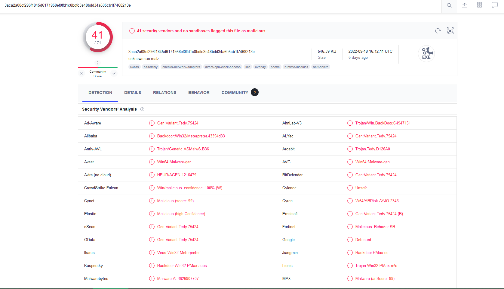

# Challenge - SikoMode

This write-up included answers and my solutions methods. Author of challenge is [HuskyHacks](https://github.com/HuskyHacks).

 link: [PMAT-labs/labs/2-3.Challenge-SikoMode at main · HuskyHacks/PMAT-labs · GitHub](https://github.com/HuskyHacks/PMAT-labs/tree/main/labs/2-3.Challenge-SikoMode)

# Abstract

Analyst,

This specimen came from a poor decision and a link that should not have been clicked on. No surprises there. We need to figure out the extent of what this thing can do. It looks a little advanced.

Perform a full analysis and send us the report when done. We need to go in depth on this one to determine what it is doing, so break out your decompiler and debugger and get to work!

IR Team

## Objective

Perform static and dynamic analysis on this malware sample  and extract facts about the malware's behavior. Use all tools and skills in your arsenal! Be sure to include a limited amount of debugging  and decompiling and employ advanced methodology to the extent that you are comfortable. Answer the challenge quesitons below. If you get stuck, the `answers/` directroy has the answers to the challenge.

# Report

## Hash

md5: b9497ffb7e9c6f49823b95851ec874e3
sha256: 3aca2a08cf296f1845d6171958ef0ffd1c8bdfc3e48bdd34a605cb1f7468213e

# Detonation

Self-deleted binary. Nothing more visible.

### VirusTotal



[VirusTotal link](https://www.virustotal.com/gui/file/3aca2a08cf296f1845d6171958ef0ffd1c8bdfc3e48bdd34a605cb1f7468213e)

## PEStudio


- What language is the binary written in?

```
Binary is written in Nim. Nim prefix, imports in Floss output.
```


- What is the architecture of this binary?

```
64 bits
```

- Under what conditions can you get the binary to delete itself?

```
Delete itself, when can't connect or lost contact with domain or when finishes job.
```

- Does the binary persist? If so, how?

```
No.
```

- What is the first callback domain?

```
update.ec12-4-109-278-3-ubuntu20-04.local

First HTTP packet.
```


- Under what conditions can you get the binary to exfiltrate data?

```
Malware is looking for cosmo.jpeg. After establish contact with domain, in C:\Users\Public\ unpack password.txt to encryption data. Next encoded precious content in base64 and starts encryption of data.
```


- What is the exfiltration domain?

```
cdn.altimiter.local
```


- How does exfiltration take place?

```
HTTP protocol.
```

- What URI is used to exfiltrate data?

```
http://cdn.altimiter.local/feed?post=[xyz]

xyz - encrypted and encoded in base64 data. 

```

- What type of data is exfiltrated (the file is cosmo.jpeg, but how exactly is the file's data transmitted?)

```
Data (cosmo.jpeg) is encrypted using password.txt key. Next the data are download by domain via GET method.
```


- What kind of encryption algorithm is in use?

```
This algorithm is RC4. In binary is istance of method sym.toRC4...
```


- What key is used to encrypt the data?

```
The key is stored in C:\Users\Public\ in password.txt file. The content is SikoMode.
```


- What is the significance of `houdini`?

```
Houdini is method used to removed malware from disk. There are three instances of houidini in NimMainModule.
```


## After analysis verdict

Data stealer.